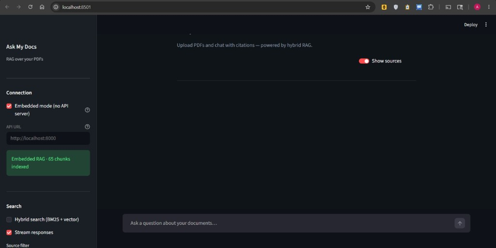
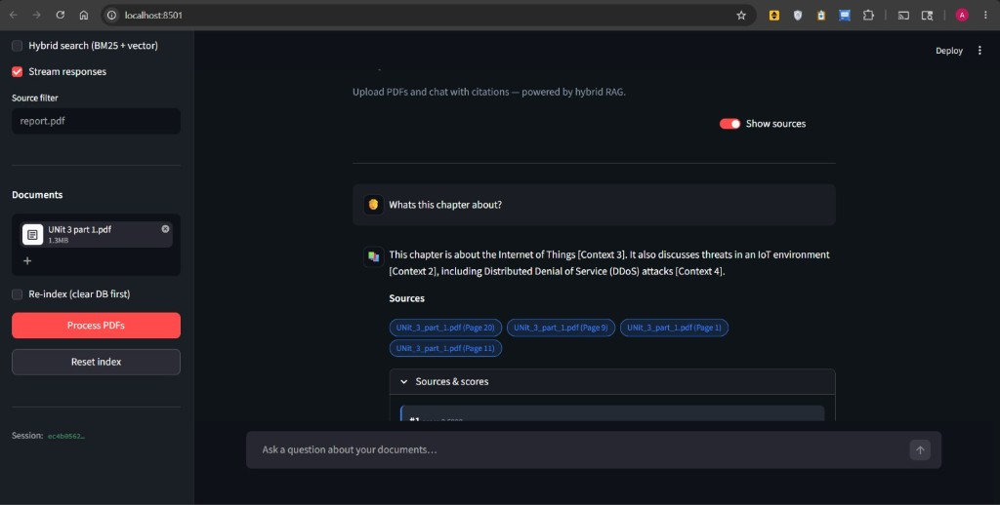
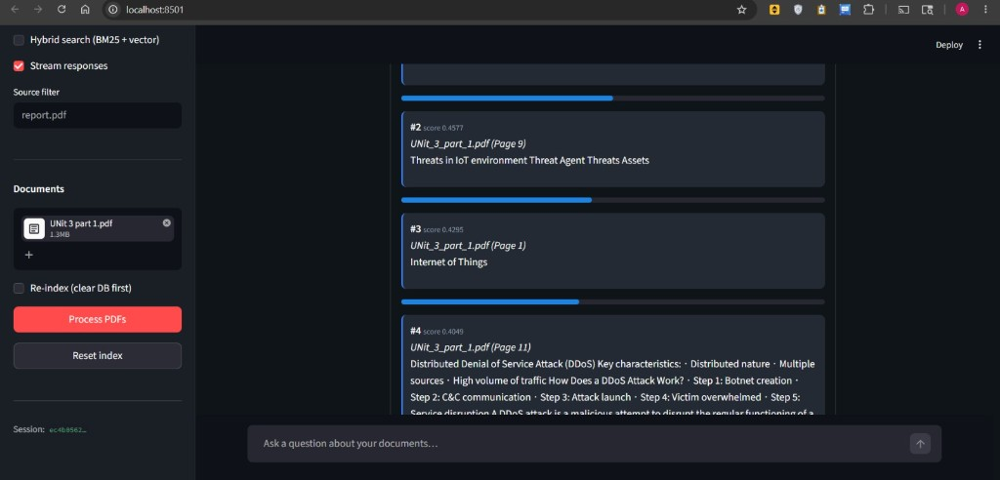
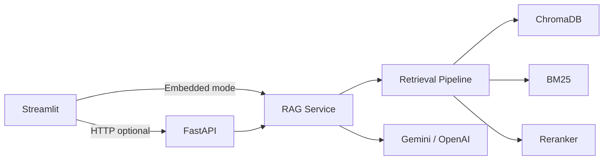

# Ask My Docs

[](https://www.python.org/)
[](https://fastapi.tiangolo.com/)
[](https://streamlit.io/)
[](https://www.trychroma.com/)
[](LICENSE)

**Upload PDFs, ask questions, get cited answers.** A production-style RAG stack with hybrid retrieval (BM25 + embeddings), optional cross-encoder reranking, a FastAPI backend, and a dark-themed Streamlit UI.

---

## Demo

| Home — embedded RAG & upload | Chat with page citations |
|:---:|:---:|
|  |  |

| AI answers with context refs | Retrieval scores & source chunks |
|:---:|:---:|
|  |  |

---

## Features

- **PDF ingestion** — Multi-file upload, chunking, deduplication, ChromaDB persistence  
- **Hybrid search** — BM25 + dense vectors with query expansion  
- **Reranking** — Optional cross-encoder (`ENABLE_RERANKING=true`)  
- **Citations** — `filename.pdf (Page N)` on every answer  
- **REST API** — FastAPI: `/chat`, `/upload`, `/health`, streaming `/chat/stream`  
- **Streamlit UI** — Dark theme, chat history, streaming, source panel with scores  
- **Embedded mode** — Run without a separate API server (great for local demos)  
- **Docker & Render** — `docker-compose.yml` + `render.yaml` blueprint  

---

## Tech stack

| Layer | Tools |
|-------|--------|
| API | FastAPI, Uvicorn, Pydantic |
| UI | Streamlit |
| Retrieval | ChromaDB, sentence-transformers, BM25 |
| LLM | Google Gemini or OpenAI |
| Deploy | Docker, Render |

---

## Architecture



```
├── backend/          # FastAPI + RAG pipeline
├── frontend/         # Streamlit UI
├── docs/screenshots/ # README demo images
├── tests/
├── docker-compose.yml
└── render.yaml
```

---

## Quick start

### Prerequisites

- Python **3.11+**
- [Gemini](https://ai.google.dev/) or [OpenAI](https://platform.openai.com/) API key

### 1. Clone & configure

```bash
git clone https://github.com/YOUR_USERNAME/ask-my-docs.git
cd ask-my-docs
cp .env.example .env
# Edit .env — set GEMINI_API_KEY
```

### 2. Run the UI (easiest — embedded RAG)

```bash
cd frontend
python -m pip install -r requirements.txt
python -m streamlit run streamlit_app.py
```

**Windows:** `.\frontend\run.ps1`

Open **http://localhost:8501** — keep **Embedded mode** checked in the sidebar.

### 3. Optional: FastAPI backend

```bash
cd backend
python -m pip install -r requirements.txt
python -m uvicorn app:app --host 0.0.0.0 --port 8000
```

API docs: **http://localhost:8000/docs** — uncheck Embedded mode in the UI and set API URL to `http://localhost:8000`.

### Run both (Windows)

```powershell
.\start.ps1
```

---

## Docker

```bash
docker compose up --build
```

| Service | URL |
|---------|-----|
| Backend | http://localhost:8000 |
| Frontend | http://localhost:8501 |

Volumes: `chroma_db/`, `uploads/`, `data/` (created at runtime, gitignored).

---

## API

| Method | Path | Description |
|--------|------|-------------|
| `GET` | `/health` | Health check + chunk count |
| `POST` | `/chat` | Question → answer, chunks, citations, latency |
| `POST` | `/chat/stream` | SSE streaming tokens |
| `POST` | `/upload` | PDF multipart upload |
| `DELETE` | `/reset` | Clear vector index |

<details>
<summary><b>Example: POST /chat</b></summary>

```bash
curl -X POST http://localhost:8000/chat \
  -H "Content-Type: application/json" \
  -d '{"question": "What is this chapter about?", "use_hybrid": false}'
```

```json
{
  "answer": "...",
  "citations": ["UNit_3_part_1.pdf (Page 9)"],
  "chunks": [{ "score": 0.53, "citation": "..." }],
  "latency_ms": 1234.5,
  "search_mode": "vector"
}
```

</details>

---

## Deploy on Render

1. Push to GitHub.  
2. **New → Blueprint** → select repo (`render.yaml`).  
3. Set `GEMINI_API_KEY` on the API service.  
4. On the UI service: `BACKEND_URL=https://<your-api>.onrender.com`  
5. Attach a **persistent disk** to the API for `chroma_db`.

---

## Configuration

See [`.env.example`](.env.example).

| Variable | Default | Description |
|----------|---------|-------------|
| `GEMINI_API_KEY` | — | Required for Gemini |
| `USE_LOCAL_RAG` | `false` | Force embedded mode in UI |
| `ENABLE_RERANKING` | `false` | Cross-encoder reranking |
| `TOP_K_RESULTS` | `4` | Chunks sent to LLM |
| `HYBRID_ALPHA` | `0.5` | Vector vs BM25 weight |

---

## Tests

```bash
pip install -r backend/requirements.txt
set PYTHONPATH=backend   # Windows
export PYTHONPATH=backend  # macOS/Linux
python -m pytest tests/test_scoring.py tests/test_bm25_lengths.py tests/test_api_health.py -q
```

---

## Project highlights (resume / portfolio)

- End-to-end RAG: ingest → retrieve → rerank → generate with **grounded citations**  
- **Hybrid retrieval** and optional reranking without breaking the modular pipeline  
- **Dual deployment**: monolithic embedded UI or split FastAPI + Streamlit  
- Production touches: Docker, health checks, CORS, latency metrics, deduplication  

---

## License

[MIT](LICENSE) — see [LICENSE](LICENSE) for details.
