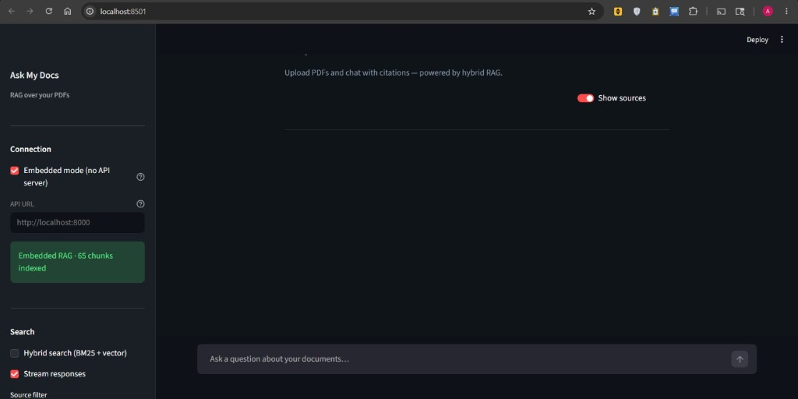
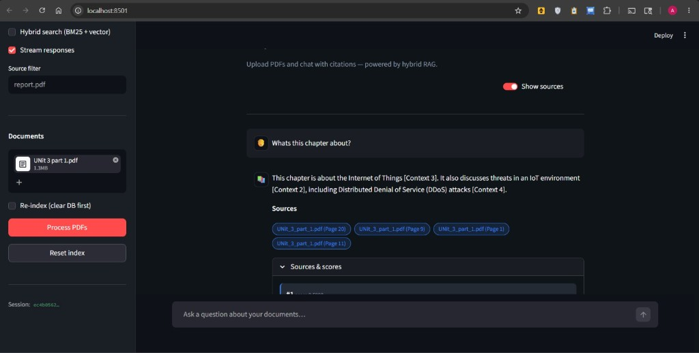
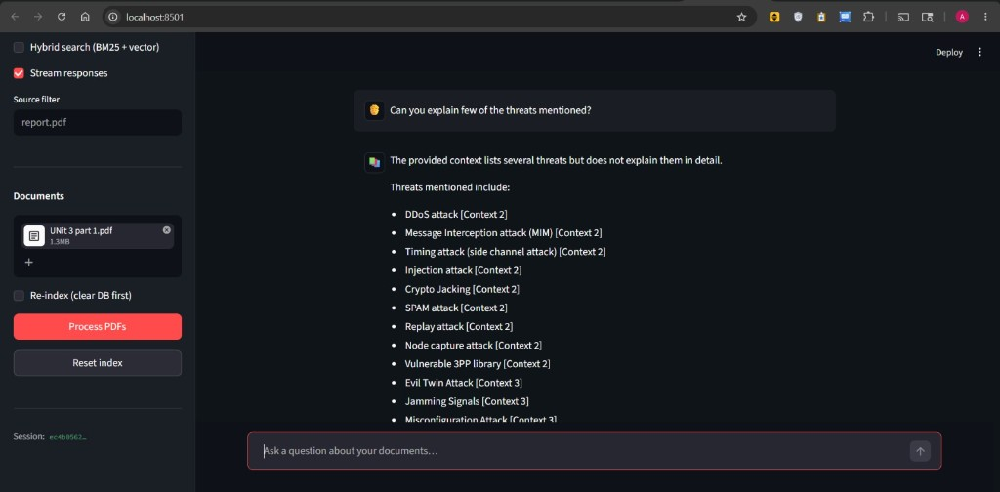
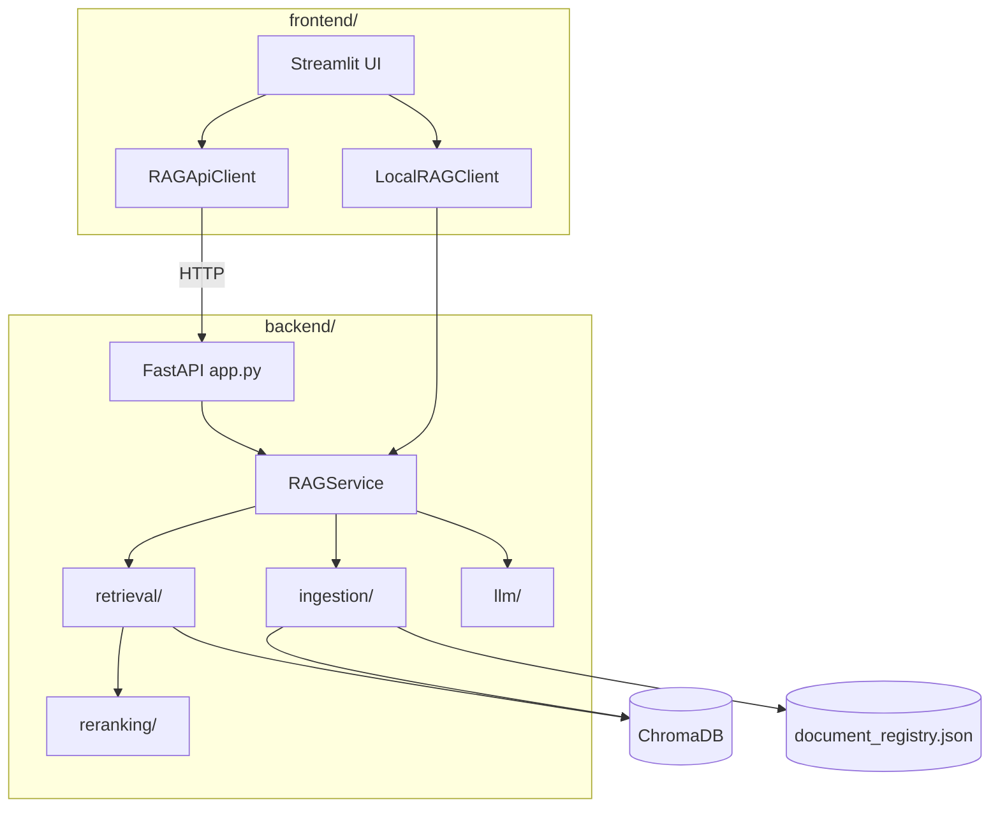

# Multi-Document AI Research Assistant

[](https://www.python.org/)
[](https://fastapi.tiangolo.com/)
[](https://streamlit.io/)
[](https://www.trychroma.com/)
[](LICENSE)

Upload PDFs, ask questions, and get **grounded answers with page-level citations** — built as a modular RAG system with hybrid retrieval, optional cross-encoder reranking, and a split FastAPI + Streamlit architecture.

**Repository:** [github.com/Ananthu-Vinod/Multi-Document-AI-Research-Assistant](https://github.com/Ananthu-Vinod/Multi-Document-AI-Research-Assistant)

---

## Demo

Upload PDFs in the sidebar → index into ChromaDB → chat with streaming answers, citation pills, and per-chunk retrieval scores.

| Home — embedded RAG & upload | Chat with page citations |
|:---:|:---:|
|  |  |

| AI answers with context refs | Retrieval scores & source chunks |
|:---:|:---:|
|  |  |

---

## Features

- **Multi-PDF ingestion** — PyPDF extraction, recursive chunking, SHA-256 deduplication, persistent ChromaDB index
- **Hybrid retrieval** — BM25 + dense vector fusion with configurable `HYBRID_ALPHA`; auto-enabled for acronym or short keyword queries
- **Query expansion** — Maps document acronyms (e.g. filename codes) to full phrases before search
- **Optional reranking** — Cross-encoder (`cross-encoder/ms-marco-MiniLM-L-6-v2`) with timeout fallback; disabled by default
- **Grounded generation** — Gemini or OpenAI with prompt-injection safeguards and `[Context N]` references in answers
- **Source citations** — API returns chunk previews, relevance scores, and `filename.pdf (Page N)` citations
- **REST API** — FastAPI with Pydantic schemas, CORS, health checks, and SSE streaming
- **Streamlit UI** — Dark-themed chat interface; calls API or runs **embedded mode** (in-process RAG, no separate server)
- **Docker & Render** — Two-service `docker-compose.yml` and `render.yaml` blueprint

---

## Architecture


```mermaid
flowchart TB
    subgraph ui [frontend/]
        ST[Streamlit UI]
        API_CLIENT[RAGApiClient]
        LOCAL[LocalRAGClient]
    end

    subgraph api [backend/]
        FAST[FastAPI app.py]
        SVC[RAGService]
        ING[ingestion/]
        RET[retrieval/]
        RR[reranking/]
        LLM[llm/]
    end

    CHROMA[(ChromaDB)]
    REG[(document_registry.json)]

    ST --> API_CLIENT
    ST --> LOCAL
    API_CLIENT -->|HTTP| FAST
    LOCAL --> SVC
    FAST --> SVC
    SVC --> ING
    SVC --> RET
    SVC --> LLM
    ING --> CHROMA
    ING --> REG
    RET --> CHROMA
    RET --> RR
```

```
Multi-Document-AI-Research-Assistant/
├── backend/
│   ├── app.py                 # FastAPI entry + CORS + lifespan
│   ├── config.py              # Environment-driven settings
│   ├── services/rag_service.py
│   ├── routes/                # chat, health, upload
│   ├── ingestion/             # PDF processing, dedup, aliases
│   ├── retrieval/             # vector, BM25, hybrid, pipeline
│   ├── reranking/             # CrossEncoderReranker
│   ├── embeddings/            # SentenceTransformer singleton
│   ├── prompting/             # System prompt + context builder
│   ├── llm/                   # Gemini / OpenAI generators
│   ├── evaluation/            # Offline metrics (not wired to API)
│   ├── requirements.txt
│   └── Dockerfile
├── frontend/
│   ├── streamlit_app.py
│   ├── components/            # api_client, local_client, chat, sidebar
│   ├── styles/dark_theme.css
│   ├── requirements.txt
│   └── Dockerfile
├── docs/screenshots/
├── tests/
├── docker-compose.yml
├── render.yaml
└── .env.example
```

---

## Retrieval Pipeline

### 1. Document ingestion

- PDFs uploaded via `POST /upload` or the Streamlit sidebar
- Files saved with path-traversal-safe names (`utils/files.py`)
- **Deduplication:** SHA-256 hash checked against `data/document_registry.json`; duplicates skipped

### 2. Chunking

- `PyPDFLoader` extracts text per page
- `RecursiveCharacterTextSplitter` splits with:
  - `CHUNK_SIZE=1000` characters (default)
  - `CHUNK_OVERLAP=200`
  - Separators: `\n\n`, `\n`, `. `, ` `, `""`
- Metadata attached: `source`, `page`, `chunk_id`, `session_id`, `document_hash`, `aliases`

### 3. Embedding generation

- Model: **`sentence-transformers/all-MiniLM-L6-v2`** (384-dim, L2-normalized)
- Process-wide singleton via `embeddings/generator.py` (loaded once per process)
- Wrapped for LangChain/Chroma in `SentenceTransformerEmbeddings`

### 4. Storage

- **ChromaDB** persistent client at `chroma_db/` (cosine HNSW space)
- Collection name: `documents` (configurable)
- BM25 index rebuilt in memory on startup from persisted chunks

### 5. Retrieval

Orchestrated by `RetrievalPipeline` (`retrieval/pipeline.py`):

1. **Query expansion** — Appends related phrases when query contains known document acronyms
2. **Mode selection** — Vector search by default; hybrid auto-triggered for acronyms or queries ≤ 6 tokens (`should_use_hybrid`)
3. **Candidate pool** — `TOP_K × RETRIEVAL_CANDIDATE_MULTIPLIER`, capped at `MAX_RETRIEVAL_RESULTS`
4. **Vector path** — Chroma similarity with distance → similarity conversion; threshold filter (`SIMILARITY_THRESHOLD`)
5. **Hybrid path** — Normalized BM25 + vector scores fused: `α × vector + (1−α) × BM25` (`HYBRID_ALPHA=0.5`)
6. **Context packing** — Top chunks packed into `MAX_CONTEXT_CHARS` / `MAX_CONTEXT_TOKENS` budget (`utils/tokens.py`)

### 6. Reranking (optional)

- `CrossEncoderReranker` using `cross-encoder/ms-marco-MiniLM-L-6-v2`
- Controlled by `ENABLE_RERANKING` (default **`false`**)
- Thread-pool timeout (`RERANK_TIMEOUT_SECONDS`); falls back to pre-rerank order on failure

### 7. Answer generation with citations

- `ContextBuilder` formats chunks as `[Context N]` blocks with source/page metadata
- `SYSTEM_PROMPT` treats retrieved text as untrusted data (prompt-injection mitigation)
- LLM providers:
  - **Gemini** (default) — model fallbacks on 404/429 (`GEMINI_MODEL_FALLBACKS`)
  - **OpenAI** — `gpt-3.5-turbo` default via Chat Completions API
- API response includes `answer`, `chunks[]`, `citations[]`, `latency_ms`, `search_mode`
- Page citations formatted as `source.pdf (Page N)` in `utils/citations.py`

---

## Tech Stack

| Layer | Technology |
|-------|------------|
| API | FastAPI, Uvicorn, Pydantic v2 |
| UI | Streamlit, custom dark CSS |
| Orchestration | `RAGService` facade (`services/rag_service.py`) |
| PDF parsing | LangChain `PyPDFLoader`, `pypdf` |
| Chunking | LangChain `RecursiveCharacterTextSplitter` |
| Embeddings | `sentence-transformers/all-MiniLM-L6-v2` |
| Vector DB | ChromaDB (`langchain-chroma`) |
| Keyword search | Custom BM25 (`retrieval/bm25.py`) |
| Reranking | `sentence-transformers` CrossEncoder |
| LLM | Google Gemini (`google-generativeai`), OpenAI (`openai`) |
| Token budgeting | `tiktoken` (fallback: char estimate) |
| Deploy | Docker Compose, Render Blueprint |

---

## Quick Start

**Prerequisites:** Python 3.11+, Gemini or OpenAI API key

```bash
git clone https://github.com/Ananthu-Vinod/Multi-Document-AI-Research-Assistant.git
cd Multi-Document-AI-Research-Assistant
cp .env.example .env
# Edit .env — set GEMINI_API_KEY (or OPENAI_API_KEY + LLM_PROVIDER=openai)
```

### Fastest path — Streamlit with embedded RAG (one terminal)

```bash
cd frontend
python -m pip install -r requirements.txt
python -m streamlit run streamlit_app.py
```

Open **http://localhost:8501**. Keep **Embedded mode** checked in the sidebar (no FastAPI server required).

**Windows shortcut:** `frontend\run.ps1`

### Full stack — API + UI (two terminals)

```bash
# Terminal 1
cd backend
python -m pip install -r requirements.txt
python -m uvicorn app:app --host 0.0.0.0 --port 8000

# Terminal 2
cd frontend
python -m pip install -r requirements.txt
python -m streamlit run streamlit_app.py
```

Uncheck **Embedded mode** and set API URL to `http://localhost:8000`.

Interactive API docs: **http://localhost:8000/docs**

---

## Configuration

Copy [`.env.example`](.env.example). Variables read by `backend/config.py`:

| Variable | Default | Purpose |
|----------|---------|---------|
| `GEMINI_API_KEY` | — | Required when `LLM_PROVIDER=gemini` |
| `OPENAI_API_KEY` | — | Required when `LLM_PROVIDER=openai` |
| `LLM_PROVIDER` | `gemini` | `gemini` or `openai` |
| `GEMINI_MODEL` | `gemini-2.5-flash` | Primary Gemini model |
| `GEMINI_MODEL_FALLBACKS` | comma-separated list | Retry models on 404/429 |
| `OPENAI_MODEL` | `gpt-3.5-turbo` | OpenAI chat model |
| `EMBEDDING_MODEL` | `all-MiniLM-L6-v2` | Sentence-transformers model |
| `CHUNK_SIZE` / `CHUNK_OVERLAP` | `1000` / `200` | PDF chunking |
| `TOP_K_RESULTS` | `4` | Final chunks returned to LLM |
| `HYBRID_ALPHA` | `0.5` | Vector weight in hybrid fusion |
| `ENABLE_RERANKING` | `false` | Enable cross-encoder reranker |
| `MAX_CONTEXT_CHARS` | `12000` | LLM context char budget |
| `BACKEND_URL` | `http://localhost:8000` | Streamlit → API URL |
| `USE_LOCAL_RAG` | `false` | Force embedded mode in UI |
| `PORT` | `8000` (API) | Set by Render at runtime |

---

## API Endpoints

| Method | Path | Description |
|--------|------|-------------|
| `GET` | `/` | API metadata |
| `GET` | `/health` | Status, chunk count, LLM configured flag |
| `GET` | `/stats` | Session index stats (`?session_id=`) |
| `POST` | `/chat` | RAG query → answer, chunks, citations, `latency_ms` |
| `POST` | `/chat/stream` | SSE stream (`event: meta` then token events) |
| `POST` | `/upload` | Multipart PDF upload (`files`, `?reindex=true`) |
| `DELETE` | `/reset` | Clear Chroma collection + document registry |

**`POST /chat` body (JSON):**

```json
{
  "question": "What threats are mentioned?",
  "use_hybrid": false,
  "source_filter": "report.pdf",
  "session_id": null,
  "stream": false
}
```

---

## Deployment

### Docker Compose

From project root (requires `.env` with API keys):

```bash
docker compose up --build
```

| Service | Port | Image |
|---------|------|-------|
| `backend` | 8000 | `backend/Dockerfile` |
| `frontend` | 8501 | `frontend/Dockerfile` |

Volumes: `./chroma_db`, `./uploads`, `./data`

### Render

[`render.yaml`](render.yaml) defines two Docker web services:

1. **`ask-my-docs-api`** — backend with 1 GB disk at `/app/chroma_db`
2. **`ask-my-docs-ui`** — frontend; `BACKEND_URL` wired from API service host

Set `GEMINI_API_KEY` (and optionally `OPENAI_API_KEY`) in the Render dashboard before deploy.

---

## Testing

`tests/conftest.py` adds `backend/` to `PYTHONPATH`.

**Automated tests (no API keys required):**

```bash
python -m pip install -r backend/requirements.txt
# Windows
set PYTHONPATH=backend
# macOS / Linux
export PYTHONPATH=backend

python -m pytest tests/test_scoring.py tests/test_bm25_lengths.py tests/test_api_health.py -v
```

| File | What it verifies |
|------|------------------|
| `test_scoring.py` | Distance→similarity mapping, score normalization |
| `test_bm25_lengths.py` | BM25 document length calculation |
| `test_api_health.py` | `GET /` and `GET /health` via FastAPI TestClient |

Additional modules (`test_hybrid_retriever.py`, `test_vector_store.py`, `test_document_processor.py`, `test_llm_generator.py`) are integration-style scripts that may require sample PDFs or live API keys.

`backend/evaluation/metrics.py` provides offline RAG metrics (precision@k, MRR, faithfulness proxy) — not exposed via the API.

---

## Engineering Highlights

- **Modular RAG pipeline** — Ingestion, retrieval, reranking, prompting, and generation are separate packages; orchestrated through a single `RAGService.ask()` entry point
- **Hybrid retrieval** — Combines semantic and lexical search with score normalization and similarity thresholds, not a single-vector baseline
- **Production API design** — Typed request/response models, structured errors, CORS, health checks, per-request latency reporting
- **SSE streaming** — `/chat/stream` emits retrieval metadata first, then token chunks for responsive UI
- **Dual runtime modes** — Same RAG logic served via FastAPI or embedded in Streamlit (`LocalRAGClient`) for simpler local demos
- **Operational safeguards** — PDF deduplication, secure upload paths, prompt-injection rules, Gemini model fallbacks, reranker timeout fallback
- **Deployable artifacts** — Separate Docker images, health checks, Render blueprint with persistent vector storage

---

## Future Improvements

- Wire `backend/evaluation/metrics.py` into an offline eval CLI
- Feed stored session history into multi-turn prompts
- Async background indexing for large PDF batches
- Authentication for multi-tenant API access

---

## License

[MIT](LICENSE) — Copyright (c) 2026
