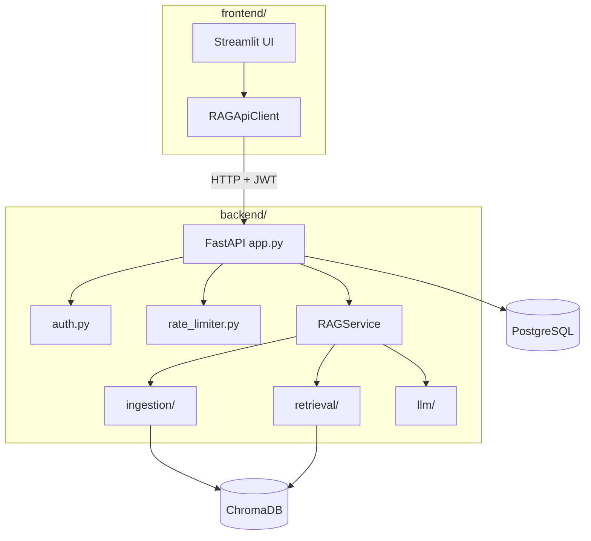

# Multi-Document AI Research Assistant (Production SaaS Ready)

[](https://www.python.org/)
[](https://fastapi.tiangolo.com/)
[](https://streamlit.io/)
[](https://www.postgresql.org/)
[](https://www.trychroma.com/)
[](LICENSE)

Upload PDFs, ask questions, and get **grounded answers with page-level citations** — built as a modular production-ready RAG application featuring simple JWT authentication, PostgreSQL persistence, hybrid BM25 + vector retrieval, rate limiting, and automated deployment configuration.

---

## Production Features

- **JWT Authentication & Accounts** — Lightweight user registration, password hashing (`bcrypt`), login, and JWT bearer token authorization (`/auth/register`, `/auth/login`, `/auth/me`).
- **PostgreSQL Persistence** — Relational database schema (`SQLAlchemy`) for user accounts, document upload registries, and persistent chat query history.
- **Multi-PDF Ingestion** — PyPDF extraction, recursive character chunking, SHA-256 deduplication, file size limits (50MB cap), PDF header byte validation, persistent ChromaDB index.
- **Hybrid Retrieval & Reranking** — BM25 + dense vector fusion with configurable `HYBRID_ALPHA`, query acronym expansion, optional cross-encoder reranking.
- **Security & Rate Limiting** — `slowapi` rate limiting on heavy endpoints (60/min chat, 20/min uploads), input validation, CORS hardening, non-root Docker execution.
- **Monitoring & Observability** — `/healthz` (liveness), `/readyz` (readiness), `/metrics` (Prometheus/JSON stats), structured JSON logging formatters.
- **DevOps & Cloud Ready** — Multi-stage production Dockerfiles, `docker-compose.yml` (Backend + Frontend + Postgres), GitHub Actions CI pipeline (`.github/workflows/ci.yml`), Google Cloud Run deploy script (`deploy/deploy_gcp.sh`).

---

## Architecture


```mermaid
flowchart TB
    subgraph ui [frontend/]
        ST[Streamlit UI]
        API_CLIENT[RAGApiClient]
    end

    subgraph api [backend/]
        FAST[FastAPI app.py]
        AUTH[auth.py]
        LIMIT[rate_limiter.py]
        SVC[RAGService]
        ING[ingestion/]
        RET[retrieval/]
        LLM[llm/]
    end

    DB[(PostgreSQL)]
    CHROMA[(ChromaDB)]

    ST --> API_CLIENT
    API_CLIENT -->|HTTP + JWT| FAST
    FAST --> AUTH
    FAST --> LIMIT
    FAST --> DB
    FAST --> SVC
    SVC --> ING
    SVC --> RET
    SVC --> LLM
    ING --> CHROMA
    RET --> CHROMA
```

---

## Quick Start (Docker Compose)

The easiest way to run the application locally or on a server with PostgreSQL, FastAPI, and Streamlit:

```bash
# 1. Clone the repository
git clone https://github.com/Ananthu-Vinod/Multi-Document-AI-Research-Assistant.git
cd Multi-Document-AI-Research-Assistant

# 2. Copy environment file
cp .env.example .env

# 3. Add your Gemini / OpenAI API key to .env
# GEMINI_API_KEY=your_key_here

# 4. Start all services in background
docker-compose up -d --build

# 5. Check container status
docker-compose ps
```

- **Frontend Interface**: [http://localhost:8501](http://localhost:8501)
- **Backend Swagger Docs**: [http://localhost:8000/docs](http://localhost:8000/docs)
- **Health Check**: [http://localhost:8000/healthz](http://localhost:8000/healthz)
- **Metrics**: [http://localhost:8000/metrics](http://localhost:8000/metrics)

---

## REST API Reference

| Method | Endpoint | Description | Auth Required |
| :--- | :--- | :--- | :---: |
| `POST` | `/auth/register` | Register new user account | No |
| `POST` | `/auth/login` | Login and receive JWT access token | No |
| `GET` | `/auth/me` | Fetch current user profile | **Yes (Bearer)** |
| `POST` | `/upload` | Upload & index PDF files (max 50MB) | Optional |
| `POST` | `/chat` | Submit question & retrieve answer with citations | Optional |
| `POST` | `/chat/stream` | Stream answer tokens via Server-Sent Events (SSE) | Optional |
| `GET` | `/healthz` | Liveness health check | No |
| `GET` | `/readyz` | Readiness probe (DB & Vector store health) | No |
| `GET` | `/metrics` | Application & database metrics | No |

---

## Google Cloud Deployment

Deploy to Google Cloud Run and Cloud SQL in one command:

```bash
chmod +x deploy/deploy_gcp.sh
GCP_PROJECT_ID="your-gcp-project" GCP_REGION="us-central1" ./deploy/deploy_gcp.sh
```

See [deploy/README.md](deploy/README.md) for full deployment details.
